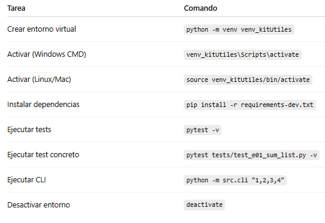
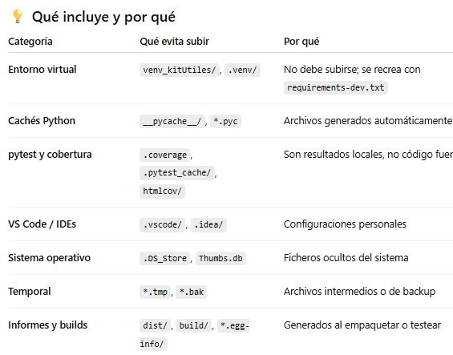
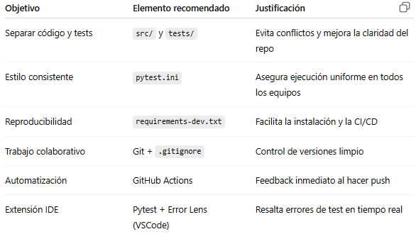

# 🧩 Proyecto: Kit Útiles
Mini proyecto en **Python** diseñado para practicar las **pruebas unitarias** con `pytest` y las buenas prácticas de desarrollo.
Forma parte de la unidad de trabajo sobre **introducción al testing** en entornos de programación.

# 🎯 Objetivo
Aprender a:
  * Crear un entorno de desarrollo aislado con venv.
  * Aplicar el patrón AAA (Arrange, Act, Assert).
  * Desarrollar con TDD (Red → Green → Refactor).
  * Escribir tests con pytest.
  * Probar funciones, excepciones, E/S y pequeños scripts CLI.
  * Mantener un proyecto limpio con .gitignore.

## 📂 Estructura
kit_utiles/
├── src/                      # Código fuente del proyecto
│   ├── __init__.py
│   ├── numbers.py
│   ├── strings.py
│   ├── files.py
│   └── cli.py
│
├── tests/                    # Carpeta de tests (pytest)
│   ├── test_e01_sum_list.py
│   ├── test_e02_unique_sorted.py
│   ├── test_e03_leap_year.py
│   ├── test_e04_safe_divide.py
│   ├── test_e05_word_count.py
│   ├── test_e06_file_roundtrip.py
│   ├── test_e07_mean.py
│   ├── test_e08_cli_sum.py
│   ├── test_e09_validate_email.py
│   └── test_e10_grade.py
│
├── pytest.ini                # Configuración global de pytest
├── requirements-dev.txt      # Dependencias de desarrollo
├── venv_kitUtiles/           # Entorno virtual (NO subir a Git)
├── .gitignore                # Archivos y carpetas a ignorar
└── README.md                 # Este documento

## ⚙️ 1️⃣ Crear el entorno virtual
🔹 Windows (PowerShell o CMD)
```bash
python -m venv venv_kitUtiles
```

🔹 macOS / Linux
```bash
python3 -m venv venv_kitUtiles
```

## ⚙️ 2️⃣ Activar el entorno virtual
🟣 En Windows (CMD)
```bash
venv_kitUtiles\Scripts\activate
```

🟢 En PowerShell
  Si da error de permisos, ejecuta una vez:
  Set-ExecutionPolicy -Scope CurrentUser -ExecutionPolicy RemoteSigned
  Luego:
  ```bash
  venv_kitUtiles\Scripts\Activate.ps1
  ```

🔵 En macOS / Linux
  ```bash
  source venv_kitUtiles/bin/activate
  ```

## ⚙️ 3️⃣ Desactivar el entorno

Cuando termines:
  ```bash
  deactivate
  ```
## 🧠 4️⃣ Buenas prácticas
  * Los tests deben cubrir todos los casos del código.
  * Cada test se nombra con el prefijo test_ y una descripción clara.
  * No uses print() en los tests.
  * No edites los archivos del módulo src/, solo los tests.
  * Ejecuta pytest -v antes de cada commit.


## ⚙️ 5️⃣ Instalar dependencias
Con el entorno activo:
  ```bash
  pip install --upgrade pip
  pip install -r requirements-dev.txt
  ```

📦 Ejemplo de requirements-dev.txt:
  ```bash
  pytest>=8.0
  pytest-cov
  ```

## 6️⃣ Cómo ejecutar los tests
1. Instala dependencias:
🔸 Todos los tests:
  ```bash
  pytest -v
  ```

🔸 Un test concreto:
  ```bash
  pytest tests/test_e04_safe_divide.py -v
  ```

🔸 Con cobertura:
  ```bash
  pytest --cov=src --cov-report=term-missing
  ```

## ⚙️ 6️⃣ Probar el CLI
Ejecuta directamente desde el proyecto:
```bash
python -m src.cli "1,2,3,4"
```
Debería mostrar:
10.0

## 7️⃣Ejecución



## 🧾 `.gitignore` recomendado

# =====================================
# ENTORNOS VIRTUALES
# =====================================
venv_kitUtiles/
.venv/
env/
ENV/
venv/

# =====================================
# PYTHON CACHE / COMPILADOS
# =====================================
__pycache__/
*.pyc
*.pyo
*.pyd
*.pdb
*.pkl
*.db
*.sqlite3

# =====================================
# CONFIGURACIÓN Y METADATOS DE TESTING
# =====================================
.coverage
htmlcov/
.cache/
*.log
*.tmp
*.bak
*.swp
coverage.xml
coverage.json
.pytest_cache/
.mypy_cache/
ruff_cache/
pytestdebug.log

# =====================================
# ENTORNOS DE DESARROLLO E IDEs
# =====================================
.vscode/
.idea/
.spyproject/
.pyre/

# =====================================
# REPORTES / BUILDS / DISTRIBUCIÓN
# =====================================
logs/
reports/
dist/
build/
*.egg-info/



## 8️⃣ ⚙️ `.github/workflows/tests.yml` (opcional, CI/CD)

```yaml
name: tests
on: [push, pull_request]
jobs:
  pytest:
    runs-on: ubuntu-latest
    steps:
      - uses: actions/checkout@v4
      - uses: actions/setup-python@v5
        with:
          python-version: '3.11'
      - run: pip install -r requirements-dev.txt
      - run: pytest -v --cov=src --cov-report=term-missing
```


## 9️⃣🧩 Autor / Contexto educativo

Proyecto de práctica didáctica —
FP Euskadi · Curso de Especialización en Inteligencia Artificial y Big Data
Asignatura: Programación de Inteligencia Artificial
Tema: Pruebas unitarias con pytest

### 🧠 Resumen rápido de comandos

